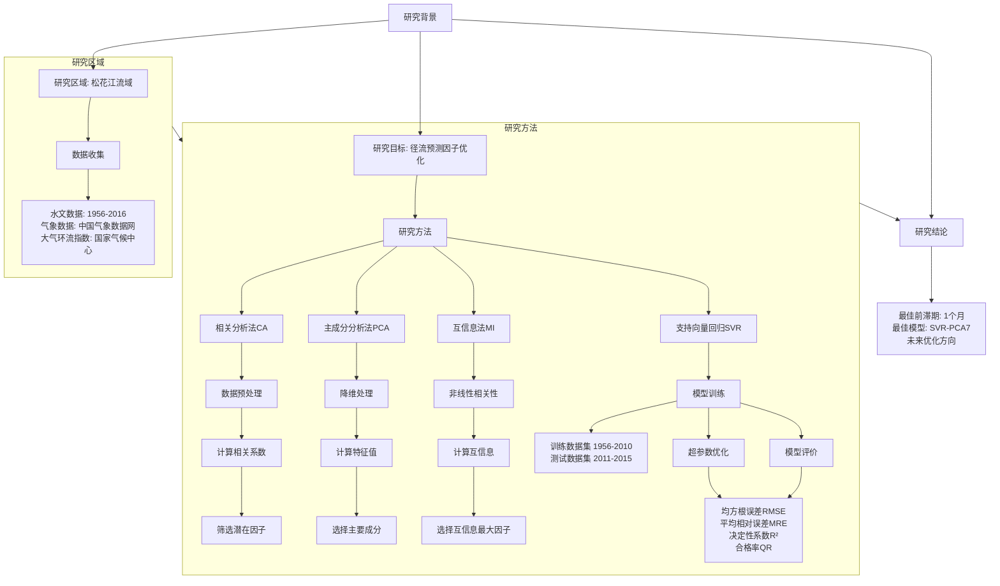

```mermaid
graph TD;
    A[研究背景] --> B[研究区域: 松花江流域]
    A --> C[研究目标: 径流预测因子优化]
    A --> K[研究结论]


subgraph N[研究区域]
    B --> D[数据收集]
    D --> D1[水文数据: 1956-2016<br>气象数据: 中国气象数据网<br>大气环流指数: 国家气候中心]
end
    
subgraph M[研究方法]
    C --> E[研究方法]
    E --> E1[相关分析法CA]
    E --> E2[主成分分析法PCA]
    E --> E3[互信息法MI]
    E --> E4[支持向量回归SVR]
    
    E1 --> F[数据预处理]
    F --> F1[计算相关系数]
    F1 --> F2[筛选潜在因子]
    
    E2 --> G[降维处理]
    G --> G1[计算特征值]
    G1 --> G2[选择主要成分]
    
    E3 --> H[非线性相关性]
    H --> H1[计算互信息]
    H1 --> H2[选择互信息最大因子]
    
    E4 --> I[模型训练]
    I --> I1[训练数据集 1956-2010<br>测试数据集 2011-2015]
    I --> I3[超参数优化]
    I3 --> J1

    I --> J[模型评价]
    J --> J1[均方根误差RMSE<br>平均相对误差MRE<br>决定性系数R²<br>合格率QR]
end

    N --> M
    M --> K
    K --> K1[最佳前滞期: 1个月<br>最佳模型: SVR-PCA7<br>未来优化方向]
```